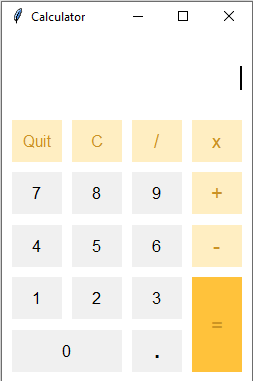
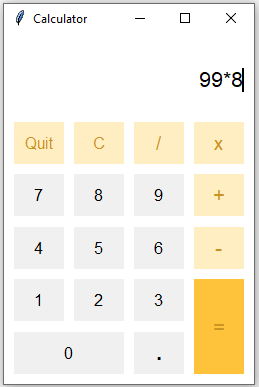
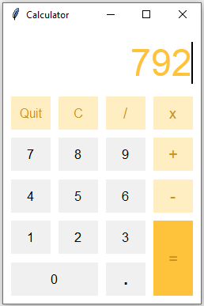

This **calculator** uses the popular python GUI (Graphical User Interface) library, Tkinter  

On running the application, the interface looks like this:  

  

After inputting values, it looks like this:  

  

Finally, the result displays like this:  

